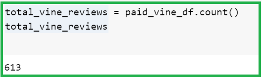
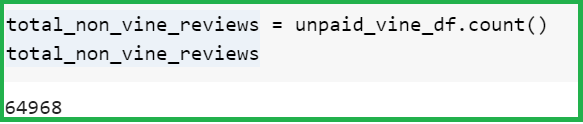
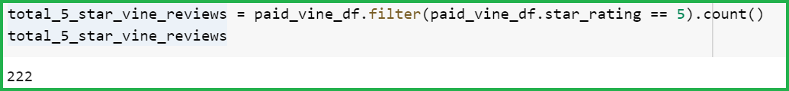
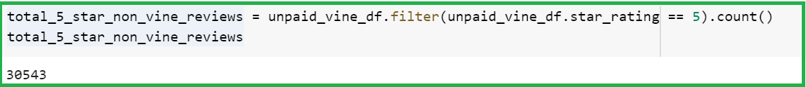
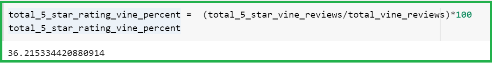
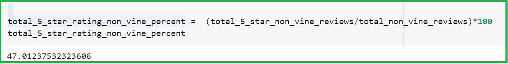

# Amazon_Vine_Analysis

## Overview of the project

In this project, we worked on a reviews data-set using PySpark in Google colab. PySpark is an interface for Apache Spark in Python. It not only allows us to write Spark applications using Python APIs, but also provides the PySpark shell for interactively analyzing our data in a distributed environment. PySpark supports most of Spark’s features such as Spark SQL, DataFrame, Streaming, MLlib (Machine Learning) and Spark Core.

## Purpose 

The main purpose of the project was to use PySpark to perform the ETL process to extract the dataset, transform the data, connect to an AWS RDS instance, and load the transformed data into pgAdmin. Furthermore, Pyspark was used to determine if there is any bias toward favorable reviews from Vine members in the dataset.

## Results

-   **How many Vine reviews and non-Vine reviews were there?**

Total number of vine reviews were 613 whereas, total non-vine reviews were 64968.

-   **How many Vine reviews were 5 stars? How many non-Vine reviews were 5 stars?**

Total number of 5-star vine reviews were 222 whereas, total non-vine 5-star reviews were 30543.

-   **What percentage of Vine reviews were 5 stars? What percentage of non-Vine reviews were 5 stars?**

Total percentage of 5-star vine reviews were approx 36% whereas, total percentage of non-vine 5-star reviews were approx 47%.

## Summary

Above analysis shows that the total percentage of 5-star rating non-paid reviews was more than the total percentage of 5-star
rating paid reviews. This shows that there is no positivity bias for reviews in the Vine program. Although the number of paid
reviews is almost 1/100th fraction of the total number of unpaid reviews, but the current data does not evince enough evidence
to project any positivity bias.

In addition to above analysis, we can also compare the total votes, helpful votes and their ratio for paid and unpaid reviews.
This will help us ascertain if the helpful votes are higher in case of paid 5-star reviews versus the unpaid 5-star reviews.
If the helpful votes are higher for paid reviews then it would mean that paid reviews are not biased else it would indicate a
bias.